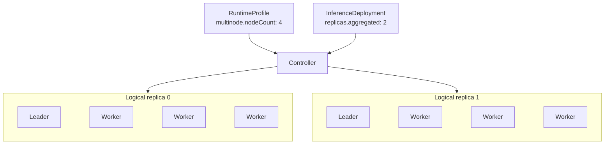

## Overview {#overview}

`RuntimeProfile` and `ClusterRuntimeProfile` declare reusable inference runtime templates, including the inference engine (`backend`), the inference image and startup arguments, how LoRA adapters are loaded, single-node or multinode deployment, the Aggregated or Prefill/Decode roles, and the default Endpoint Picker strategy. They differ only in scope:

- `RuntimeProfile` is a namespaced resource that can be reused within a Namespace.
- `ClusterRuntimeProfile` is a cluster-scoped resource that can be shared across Namespaces.

`RuntimeProfile` and `ClusterRuntimeProfile` use the same `RuntimeProfileSpec`. A Profile describes one logical replica per role; it neither specifies deployment replica counts nor binds to a specific Model.

The following is an example of an Aggregated RuntimeProfile. It uses the vLLM inference engine. The `engine` container in the Pod template runs the vLLM image, reads the model from `$(FUSIONINFER_MODEL_PATH)`, which the Controller injects, and serves inference on port 8000, named `http`:

```yaml
apiVersion: fusioninfer.io/v1alpha1
kind: RuntimeProfile
metadata:
  name: vllm-aggregated
  namespace: team-a
spec:
  backend: vllm
  aggregated:
    podTemplate:
      spec:
        containers:
          - name: engine
            image: vllm/vllm-openai:v0.27.1
            args:
              - $(FUSIONINFER_MODEL_PATH)
            ports:
              - name: http
                containerPort: 8000
```

## Spec {#spec}

### API Structure {#api-structure}

`RuntimeProfile` and `ClusterRuntimeProfile` share the following Go API:

```go
// RuntimeBackend is the inference engine of the runtime.
// +kubebuilder:validation:Enum=vllm;sglang
type RuntimeBackend string

const (
    RuntimeBackendVLLM   RuntimeBackend = "vllm"
    RuntimeBackendSGLang RuntimeBackend = "sglang"
)

// RuntimeProfileSpec declares a reusable inference runtime, and is shared by RuntimeProfile and ClusterRuntimeProfile.
type RuntimeProfileSpec struct {
    Backend        RuntimeBackend        `json:"backend"`
    LoRA           *RuntimeLoRASpec      `json:"lora,omitempty"`
    EndpointPicker *EndpointPickerSpec   `json:"endpointPicker,omitempty"`
    Aggregated     *RuntimeComponentSpec `json:"aggregated,omitempty"`
    Prefiller      *RuntimeComponentSpec `json:"prefiller,omitempty"`
    Decoder        *RuntimeComponentSpec `json:"decoder,omitempty"`
}

// LoRALoadingMode is when the runtime loads the LoRA adapters bound to it.
// +kubebuilder:validation:Enum=preload;dynamic
type LoRALoadingMode string

const (
    LoRALoadingModePreload LoRALoadingMode = "preload"
    LoRALoadingModeDynamic LoRALoadingMode = "dynamic"
)

// RuntimeLoRASpec declares how the runtime loads the LoRA adapters that an InferenceDeployment binds.
type RuntimeLoRASpec struct {
    LoadingMode LoRALoadingMode `json:"loadingMode"`
}

// EndpointPickerSpec declares how the Endpoint Picker spreads requests among the logical replicas. InferenceDeployment uses the same type.
type EndpointPickerSpec struct {
    // Reuses the existing v1alpha1 RoutingStrategy type and allows only these three values.
    // +kubebuilder:validation:Enum=prefix-cache;kv-cache-utilization;queue-size
    Strategy RoutingStrategy `json:"strategy"`
}

// RuntimeComponentSpec declares one role: the Pod template of a logical replica and whether the replica spans several nodes.
type RuntimeComponentSpec struct {
    PodTemplate corev1.PodTemplateSpec `json:"podTemplate"`
    Multinode   *MultinodeSpec         `json:"multinode,omitempty"`
}

// MultinodeSpec declares a logical replica that spans several nodes: one Leader and nodeCount - 1 Workers.
type MultinodeSpec struct {
    // +kubebuilder:validation:Minimum=2
    NodeCount int32 `json:"nodeCount"`
}
```

### Inference Modes and Roles {#role-fields}

The combination of role fields selects the inference mode:

| Role fields | Result |
| --- | --- |
| Only `aggregated` | Aggregated inference |
| Both `prefiller` and `decoder` | Prefill/Decode disaggregation |
| `aggregated` with `prefiller` or `decoder` | Invalid |
| Only one of `prefiller` and `decoder` | Invalid |
| None of the three | Invalid |

Each role uses the same `RuntimeComponentSpec`, and `multinode` decides how many Pods make up a logical replica:

|  | Without `multinode` | With `multinode.nodeCount: N` |
| --- | --- | --- |
| Logical replica | One Pod on one node | N Pods on N different Kubernetes Nodes: one Leader and N - 1 Workers |
| Pod template | `podTemplate` is the Pod | The Leader and the Workers are all derived from the same `podTemplate` |
| Use | Single-node inference, including a multi-GPU inference engine that requests several GPUs in one Pod | Models that must run across several nodes |

For example, `multinode.nodeCount: 4` means that one logical replica consists of one Leader Pod and three Worker Pods. If the corresponding `InferenceDeployment` sets `replicas.aggregated: 2`, the Controller creates two such logical replicas: two Leader Pods and six Worker Pods, for a total of eight Pods.



### Distributed Backend Execution {#distributed-backend-execution}

Two backends are currently supported, `vllm` and `sglang`, and all roles of a RuntimeProfile use the same backend. When `multinode` is set, the Controller derives the Leader and the Workers from the same `podTemplate` and injects their backend-specific distributed startup parameters.

The two backends start across nodes as follows:

- vLLM uses its native multiprocessing executor, and the Workers join the Leader in headless mode. See [Workload Orchestration: vLLM](./workload-orchestration.md#vllm) for the arguments.
- SGLang uses its native distributed launch, and only rank 0 serves HTTP. See [Workload Orchestration: SGLang](./workload-orchestration.md#sglang) for the arguments.

### LoRA Loading Capabilities {#lora-loading-capabilities}

`spec.lora` declares the LoRA configuration of the RuntimeProfile:

- `loadingMode: preload` loads all LoRAs when the inference engine starts; a change to the bindings redeploys the workload with the new LoRA list.
- `loadingMode: dynamic` loads and unloads LoRAs in the running inference engine; a change to the bindings does not restart the Base Model.

The following example loads LoRAs in `dynamic` mode, and the LoRA capacity comes from the inference engine arguments in `podTemplate`, such as vLLM's `--max-loras`:

```yaml
spec:
  backend: vllm
  lora:
    loadingMode: dynamic
  aggregated:
    podTemplate:
      spec:
        containers:
          - name: engine
            args:
              - $(FUSIONINFER_MODEL_PATH)
              - --enable-lora
              - --max-loras
              - "8"
```

`lora` sits at the top level of the Profile, so all roles use the same loading mode. See [InferenceDeployment: LoRA Bindings](./inference-deployment.md#lora-bindings) for how LoRAs are loaded and unloaded.

### Endpoint Picker Strategy {#endpoint-picker-strategy}

`spec.endpointPicker.strategy` declares the default Endpoint Picker strategy of the InferenceDeployments that use the Profile, which decides how requests are spread among the logical replicas:

| Strategy | Description |
| --- | --- |
| `prefix-cache` | Routes requests with the longest shared prefix to the same replica, while balancing KV cache utilization and queue depth |
| `kv-cache-utilization` | Balances load by the KV cache usage of each replica |
| `queue-size` | Routes requests to the least loaded replica to shorten waiting time |

The following example sets the default strategy to `prefix-cache`:

```yaml
spec:
  backend: vllm
  endpointPicker:
    strategy: prefix-cache
  aggregated:
    podTemplate:
      # omitted
```

An InferenceDeployment can override this default with `spec.endpoint.endpointPicker`; when neither sets it, the default strategy configured for FusionInfer applies. Only an Aggregated Profile can set this field; for a P/D deployment, the Controller generates the scheduling configuration from the Prefiller and Decoder.

### PodTemplate {#podtemplate}

`podTemplate` is a complete [`corev1.PodTemplateSpec`](https://github.com/kubernetes/api/blob/v0.35.3/core/v1/types.go#L5483-L5494). The inference engine runs in the container named `engine` and serves through the named port `http`; in multinode mode, only the Leader receives inference requests.

The Controller injects the following into the generated Pods. A template that declares any of these names or paths is rejected when the Profile is created or updated:

| Type | Name | Description |
| --- | --- | --- |
| Environment variable | `FUSIONINFER_MODEL_PATH` | Set to the Model directory `/models`. Startup commands should read the Model through `$(FUSIONINFER_MODEL_PATH)` |
| Volume | `fusioninfer-model` | Mounts the Model directory `/models` read-only |
| Volume | `fusioninfer-lora` | Mounts the LoRA directory `/adapters` read-only, with only the LoRAs bound to the current Deployment |
| Init container | `fusioninfer-model-init` | Checks the node's Model cache and downloads the Model on a miss |

The Controller injects `fusioninfer-lora` only when the InferenceDeployment binds LoRAs, and hands the LoRAs to the inference engine according to the loading mode:

- `preload`: it writes the bound LoRAs into the startup arguments, and the inference engine loads them at startup. For example, when the InferenceDeployment binds the `finance` and `customer-support` LoRAs, the Controller appends the following to the vLLM arguments:

  ```bash
  --lora-modules \
    finance=/adapters/qwen3-8b-finance-lora-r1 \
    customer-support=/adapters/qwen3-8b-support-lora-r1
  ```

  Each LoRA gets one entry: the left side is the model name that requests use to select the LoRA, and the right side is its path under `/adapters`.

- `dynamic`: it turns on the runtime LoRA API of the inference engine, for example by setting `VLLM_ALLOW_RUNTIME_LORA_UPDATING=true` for vLLM; once the Pod is running, the Controller calls that API to load and unload LoRAs.

The ServiceAccount, Secrets, ConfigMaps and PVCs that the template references are looked up in the Namespace of the InferenceDeployment that uses it. They are not checked when the Profile is created; a missing one is reported in the InferenceDeployment status.

## Status {#status}

`RuntimeProfile` and `ClusterRuntimeProfile` have no status subresource and no Controller of their own: the API server rejects errors in the Profile itself when it is created or updated, and the InferenceDeployment that uses the Profile reports in its status whether the referenced objects exist and how the workload is running.

## Examples {#examples}

### RuntimeProfile: Single-Node Aggregated {#runtimeprofile-single-node-aggregated}

This Profile describes an Aggregated logical replica that uses one A10 GPU, with a readiness probe on the `http` port and CPU and memory requests.

```yaml
apiVersion: fusioninfer.io/v1alpha1
kind: RuntimeProfile
metadata:
  name: vllm-aggregated-a10-r1
  namespace: team-a
spec:
  backend: vllm
  aggregated:
    podTemplate:
      spec:
        containers:
          - name: engine
            image: vllm/vllm-openai:v0.27.1
            args:
              - $(FUSIONINFER_MODEL_PATH)
            ports:
              - name: http
                containerPort: 8000
            readinessProbe:
              httpGet:
                path: /health
                port: http
            resources:
              requests:
                cpu: "4"
                memory: 16Gi
              limits:
                nvidia.com/gpu: "1"
        nodeSelector:
          accelerator: a10
```

### ClusterRuntimeProfile: Prefill/Decode Disaggregation {#clusterruntimeprofile-prefilldecode-disaggregation}

Both roles transfer the KV cache through NixlConnector, with `kv_role` set to `kv_both` on each side. `VLLM_NIXL_SIDE_CHANNEL_HOST` is set to the Pod IP; otherwise the Decoder cannot reach the Prefiller across Pods. The Prefiller uses two GPUs (TP=2) and the Decoder uses one. Replica counts are set in the InferenceDeployment; a P/D deployment does not choose an Endpoint Picker strategy, because the Controller generates the scheduling configuration from the Prefiller and Decoder.

```yaml
apiVersion: fusioninfer.io/v1alpha1
kind: ClusterRuntimeProfile
metadata:
  name: vllm-pd-h100-r1
spec:
  backend: vllm
  prefiller:
    podTemplate:
      spec:
        containers:
          - name: engine
            image: vllm/vllm-openai:v0.27.1
            args:
              - $(FUSIONINFER_MODEL_PATH)
              - --tensor-parallel-size
              - "2"
              - --kv-transfer-config
              - '{"kv_connector":"NixlConnector","kv_role":"kv_both"}'
            env:
              - name: VLLM_NIXL_SIDE_CHANNEL_HOST
                valueFrom:
                  fieldRef:
                    fieldPath: status.podIP
            ports:
              - name: http
                containerPort: 8000
            resources:
              limits:
                nvidia.com/gpu: "2"
        nodeSelector:
          accelerator: h100
  decoder:
    podTemplate:
      spec:
        containers:
          - name: engine
            image: vllm/vllm-openai:v0.27.1
            args:
              - $(FUSIONINFER_MODEL_PATH)
              - --kv-transfer-config
              - '{"kv_connector":"NixlConnector","kv_role":"kv_both"}'
            env:
              - name: VLLM_NIXL_SIDE_CHANNEL_HOST
                valueFrom:
                  fieldRef:
                    fieldPath: status.podIP
            ports:
              - name: http
                containerPort: 8000
            resources:
              limits:
                nvidia.com/gpu: "1"
        nodeSelector:
          accelerator: h100
```

### RuntimeProfile: vLLM Multinode Aggregated {#runtimeprofile-multinode-aggregated}

Each logical replica consists of one Leader Pod and three Worker Pods, using four nodes in total.

```yaml
apiVersion: fusioninfer.io/v1alpha1
kind: RuntimeProfile
metadata:
  name: vllm-aggregated-4node-r1
  namespace: team-a
spec:
  backend: vllm
  aggregated:
    multinode:
      nodeCount: 4
    podTemplate:
      spec:
        containers:
          - name: engine
            image: vllm/vllm-openai:v0.27.1
            args:
              - $(FUSIONINFER_MODEL_PATH)
              - --tensor-parallel-size
              - "8"
              - --pipeline-parallel-size
              - "4"
              - --data-parallel-size
              - "1"
            ports:
              - name: http
                containerPort: 8000
            resources:
              limits:
                nvidia.com/gpu: "8"
        nodeSelector:
          accelerator: h100
```

Based on `backend: vllm` and `nodeCount: 4`, the Controller injects the multiprocessing executor, node count, address, and rank for the Leader and Workers. It preserves the `TP=8`, `PP=4`, and `DP=1` values fixed in the Profile, so the user maintains only one set of vLLM arguments and one PodTemplate.

### RuntimeProfile: SGLang Multinode Aggregated {#runtimeprofile-sglang-multinode-aggregated}

This Profile runs an Aggregated logical replica across two nodes with SGLang. Each Pod uses eight GPUs, and `--tp-size 16` spans both nodes. SGLang listens on `127.0.0.1:30000` by default, so the template sets `--host 0.0.0.0` and `--port 8000` to match the `http` port.

```yaml
apiVersion: fusioninfer.io/v1alpha1
kind: RuntimeProfile
metadata:
  name: sglang-aggregated-2node-r1
  namespace: team-a
spec:
  backend: sglang
  aggregated:
    multinode:
      nodeCount: 2
    podTemplate:
      spec:
        containers:
          - name: engine
            image: lmsysorg/sglang:v0.5.4
            command:
              - python3
              - -m
              - sglang.launch_server
            args:
              - --model-path
              - $(FUSIONINFER_MODEL_PATH)
              - --tp-size
              - "16"
              - --host
              - "0.0.0.0"
              - --port
              - "8000"
            ports:
              - name: http
                containerPort: 8000
            resources:
              limits:
                nvidia.com/gpu: "8"
        nodeSelector:
          accelerator: h100
```

Based on `backend: sglang` and `nodeCount: 2`, the Controller adds `--dist-init-addr`, `--nnodes`, and `--node-rank` to each Pod and keeps the other arguments as the template declares them. See [Workload Orchestration: SGLang](./workload-orchestration.md#sglang) for details.

### RuntimeProfile: Dynamic LoRA {#runtimeprofile-dynamic-lora}

This Profile loads LoRAs in `dynamic` mode. `--enable-lora`, `--max-loras` and `--max-cpu-loras` in the template turn on LoRA support in vLLM and set its capacity; the Controller sets `VLLM_ALLOW_RUNTIME_LORA_UPDATING=true` for vLLM and then calls its API to load and unload LoRAs.

```yaml
apiVersion: fusioninfer.io/v1alpha1
kind: RuntimeProfile
metadata:
  name: vllm-aggregated-lora-dynamic-r1
  namespace: team-a
spec:
  backend: vllm
  lora:
    loadingMode: dynamic
  aggregated:
    podTemplate:
      spec:
        containers:
          - name: engine
            image: vllm/vllm-openai:v0.27.1
            args:
              - $(FUSIONINFER_MODEL_PATH)
              - --enable-lora
              - --max-loras
              - "8"
              - --max-cpu-loras
              - "8"
            ports:
              - name: http
                containerPort: 8000
            resources:
              limits:
                nvidia.com/gpu: "1"
        nodeSelector:
          accelerator: h100
```
