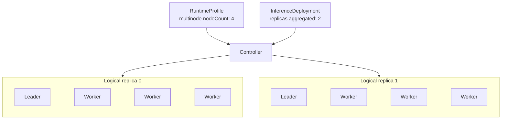

## Overview {#overview}

`RuntimeProfile` and `ClusterRuntimeProfile` declare reusable inference runtime templates, including the inference engine (`backend`), the inference image and startup arguments, how LoRA adapters are loaded, single-node or multinode deployment, and the Aggregated or Prefill/Decode roles. They differ only in scope:

- `RuntimeProfile` is a namespaced resource that can be reused within a Namespace.
- `ClusterRuntimeProfile` is a cluster-scoped resource that can be shared across Namespaces.

`RuntimeProfile` and `ClusterRuntimeProfile` use the same `RuntimeProfileSpec`. A Profile describes one logical replica per role; it neither specifies deployment replica counts nor binds to a specific Model.

The following is an example of an Aggregated RuntimeProfile. It uses the vLLM inference engine. The `engine` container in the Pod template runs the vLLM image, reads the model from `$(FUSION_MODEL_PATH)`, which the Operator injects, and serves inference on port 8000, named `http`:

```yaml
apiVersion: fusioninfer.io/v1alpha1
kind: RuntimeProfile
metadata:
  name: vllm-aggregated
  namespace: team-a
spec:
  backend: vllm
  aggregated:
    podTemplate:
      spec:
        containers:
          - name: engine
            image: vllm/vllm-openai:v0.27.1
            args:
              - $(FUSION_MODEL_PATH)
            ports:
              - name: http
                containerPort: 8000
```

## Spec {#spec}

### API Structure {#api-structure}

`RuntimeProfile` and `ClusterRuntimeProfile` share the following Go API:

```go
// RuntimeBackend is the inference engine of the runtime.
// +kubebuilder:validation:Enum=vllm;sglang
type RuntimeBackend string

const (
    RuntimeBackendVLLM   RuntimeBackend = "vllm"
    RuntimeBackendSGLang RuntimeBackend = "sglang"
)

// RuntimeProfileSpec declares a reusable inference runtime, and is shared by RuntimeProfile and ClusterRuntimeProfile.
type RuntimeProfileSpec struct {
    Backend    RuntimeBackend        `json:"backend"`
    LoRA       *RuntimeLoRASpec       `json:"lora,omitempty"`
    Aggregated *RuntimeComponentSpec `json:"aggregated,omitempty"`
    Prefiller  *RuntimeComponentSpec `json:"prefiller,omitempty"`
    Decoder    *RuntimeComponentSpec `json:"decoder,omitempty"`
}

// LoRALoadingMode is when the runtime loads the LoRA adapters bound to it.
// +kubebuilder:validation:Enum=preload;dynamic
type LoRALoadingMode string

const (
    LoRALoadingModePreload LoRALoadingMode = "preload"
    LoRALoadingModeDynamic LoRALoadingMode = "dynamic"
)

// RuntimeLoRASpec declares how the runtime loads the LoRA adapters that an InferenceDeployment binds.
type RuntimeLoRASpec struct {
    LoadingMode LoRALoadingMode `json:"loadingMode"`
}

// RuntimeComponentSpec declares one role: the Pod template of a logical replica and whether the replica spans several nodes.
type RuntimeComponentSpec struct {
    PodTemplate corev1.PodTemplateSpec `json:"podTemplate"`
    Multinode   *MultinodeSpec         `json:"multinode,omitempty"`
}

// MultinodeSpec declares a logical replica that spans several nodes: one Leader and nodeCount - 1 Workers.
type MultinodeSpec struct {
    // +kubebuilder:validation:Minimum=2
    NodeCount int32 `json:"nodeCount"`
}
```

### Inference Modes and Roles {#role-fields}

The combination of role fields selects the inference mode:

| Role fields | Result |
| --- | --- |
| Only `aggregated` | Aggregated inference |
| Both `prefiller` and `decoder` | Prefill/Decode disaggregation |
| `aggregated` with `prefiller` or `decoder` | Invalid |
| Only one of `prefiller` and `decoder` | Invalid |
| None of the three | Invalid |

Each role uses the same `RuntimeComponentSpec`, and `multinode` decides how many Pods make up a logical replica:

|  | Without `multinode` | With `multinode.nodeCount: N` |
| --- | --- | --- |
| Logical replica | One Pod on one node | N Pods on N different Kubernetes Nodes: one Leader and N - 1 Workers |
| Pod template | `podTemplate` is the Pod | The Leader and the Workers are all derived from the same `podTemplate` |
| Use | Single-node inference, including a multi-GPU inference engine that requests several GPUs in one Pod | Models that must run across several nodes |

For example, `multinode.nodeCount: 4` means that one logical replica consists of one Leader Pod and three Worker Pods. If the corresponding `InferenceDeployment` sets `replicas.aggregated: 2`, the Controller creates two such logical replicas: two Leader Pods and six Worker Pods, for a total of eight Pods.



### Distributed Backend Execution {#distributed-backend-execution}

Two backends are currently supported, `vllm` and `sglang`, and all roles of a RuntimeProfile use the same backend. When `multinode` is set, the Controller derives the Leader and the Workers from the same `podTemplate` and injects their backend-specific distributed startup parameters.

The two backends start across nodes as follows:

- vLLM uses its native multiprocessing executor, and the Workers join the Leader in headless mode. See [Workload Orchestration: vLLM](./workload-orchestration.md#vllm) for the arguments.
- SGLang uses its native distributed launch, and only rank 0 serves HTTP. See [Workload Orchestration: SGLang](./workload-orchestration.md#sglang) for the arguments.

### LoRA Loading Capabilities {#lora-loading-capabilities}

`spec.lora` declares the LoRA configuration of the RuntimeProfile:

- `loadingMode: preload` loads all LoRAs when the inference engine starts; a change to the bindings redeploys the workload with the new LoRA list.
- `loadingMode: dynamic` loads and unloads LoRAs in the running inference engine; a change to the bindings does not restart the Base Model.

The following example loads LoRAs in `dynamic` mode, and the LoRA capacity comes from the inference engine arguments in `podTemplate`, such as vLLM's `--max-loras`:

```yaml
spec:
  backend: vllm
  lora:
    loadingMode: dynamic
  aggregated:
    podTemplate:
      spec:
        containers:
          - name: engine
            args:
              - $(FUSION_MODEL_PATH)
              - --enable-lora
              - --max-loras
              - "8"
```

`lora` sits at the top level of the Profile, so all roles use the same loading mode. See [InferenceDeployment: LoRA Bindings](./inference-deployment.md#lora-bindings) for how LoRAs are loaded and unloaded.

### PodTemplate {#podtemplate}

`podTemplate` is a complete [`corev1.PodTemplateSpec`](https://github.com/kubernetes/api/blob/v0.35.3/core/v1/types.go#L5483-L5494). The inference engine runs in the container named `engine` and serves through the named port `http`; in multinode mode, only the Leader receives inference requests.

The Operator injects the following into the generated Pods, and the template cannot declare these names or paths:

| Type | Name | Description |
| --- | --- | --- |
| Environment variable | `FUSION_MODEL_PATH` | The Model directory `/models`, mounted read-only. Startup commands should read the Model through `$(FUSION_MODEL_PATH)` |
| Environment variable | `FUSION_MODEL_METADATA_PATH` | The Model metadata file `/var/run/fusioninfer/model/model.json` |
| Environment variable | `FUSION_LORA_ROOT` | The LoRA directory `/adapters`, mounted read-only, with only the LoRAs bound to the current Deployment |
| Environment variable | `FUSION_LORA_MANIFEST` | The LoRA manifest `/var/run/fusioninfer/lora/adapters.json`, which maps each `servedName` to its LoRA path |
| Volume | `fusioninfer-model`, `fusioninfer-model-metadata`, `fusioninfer-lora` | Mount the directories and files above |
| Init container | `fusioninfer-model-init` | Checks the node's Model cache and downloads the Model on a miss |

`FUSION_LORA_ROOT`, `FUSION_LORA_MANIFEST` and `fusioninfer-lora` are injected only when the InferenceDeployment declares LoRA bindings. In `dynamic` mode, the Operator also turns on the runtime LoRA API of the inference engine, for example by setting `VLLM_ALLOW_RUNTIME_LORA_UPDATING=true` for vLLM.

### Scope and References {#scope-and-references}

`RuntimeProfile` does not contain a `modelRef`. The specific Model, runtime template, and replica counts are bound by `InferenceDeployment`.

A PodTemplate can reference a ServiceAccount, Secret, ConfigMap, and PVC:

- Namespaced dependencies in a `RuntimeProfile` are resolved in the Profile's Namespace.
- Namespaced dependency names in a `ClusterRuntimeProfile` are resolved in the Namespace of the `InferenceDeployment` that consumes it.
- A `ClusterRuntimeProfile` cannot pin dependencies in another Namespace.
- When a `ClusterRuntimeProfile` is created, only the reference structure is validated. The consumer reconciles whether each dependency exists and reports the result through `InferenceDeployment.status`.

The Profile neither owns nor modifies these dependencies. ConfigMaps and Secrets that affect startup behavior should use immutable objects or versioned names.

### Defaults and Validation {#defaults-and-validation}

- `backend` is required and must be `vllm` or `sglang`.
- `lora.loadingMode` must be `preload` or `dynamic`.
- A Profile can be consumed only when the current Operator version implements the selected LoRA mode for the specified backend and template entrypoint.
- `aggregated` must be set, or both `prefiller` and `decoder` must be set.
- Every declared role must provide a `podTemplate`.
- When `multinode` is set, `nodeCount` must be at least 2; when it is omitted, the role is treated as single-node.
- `podTemplate` must be a valid `corev1.PodTemplateSpec`; the API server validates it against the Pod schema.
- The template must contain an `engine` container and exactly one named `http` port.
- Template `metadata` may contain only labels and annotations.
- The template's `schedulerName` must be empty or equal to the Volcano scheduler configured by the Operator.
- The template cannot use Operator-reserved volumes, init containers, environment variables, mount paths, labels, or annotations.
- The current Operator version must support the image and entrypoint arguments declared in the template.
- The template cannot declare the executor, address, rank, `nnodes`, or headless parameters that the Controller injects for the backend.
- The template image must be pinned by OCI digest. For readability, the examples in this document use version tags.
- `RuntimeProfile.spec` and `ClusterRuntimeProfile.spec` are immutable. Changing the backend, image, command, resources, `multinode`, or PodTemplate requires a new object.

## Status {#status}

`RuntimeProfile` and `ClusterRuntimeProfile` do not provide a status subresource and do not require a dedicated Controller. Admission validates constraints within the object, while the consuming `InferenceDeployment.status` holds the state of Namespaced dependencies and the actual runtime.

## Examples {#examples}

### RuntimeProfile: Single-Node Aggregated {#runtimeprofile-single-node-aggregated}

This Profile describes an Aggregated logical replica that uses one GPU.

```yaml
apiVersion: fusioninfer.io/v1alpha1
kind: RuntimeProfile
metadata:
  name: vllm-aggregated-a10-r1
  namespace: team-a
spec:
  backend: vllm
  aggregated:
    podTemplate:
      metadata:
        labels:
          example.fusioninfer.io/runtime: vllm
      spec:
        containers:
          - name: engine
            image: vllm/vllm-openai:v0.27.1
            args:
              - $(FUSION_MODEL_PATH)
            ports:
              - name: http
                containerPort: 8000
            readinessProbe:
              httpGet:
                path: /health
                port: http
            resources:
              requests:
                cpu: "4"
                memory: 16Gi
              limits:
                nvidia.com/gpu: "1"
        nodeSelector:
          accelerator: a10
```

### ClusterRuntimeProfile: Prefill/Decode Disaggregation {#clusterruntimeprofile-prefilldecode-disaggregation}

The Prefiller and Decoder declare their KV transfer roles separately. The Profile does not contain replica counts or an Endpoint Picker policy.

```yaml
apiVersion: fusioninfer.io/v1alpha1
kind: ClusterRuntimeProfile
metadata:
  name: vllm-pd-h100-r1
spec:
  backend: vllm
  prefiller:
    podTemplate:
      spec:
        containers:
          - name: engine
            image: vllm/vllm-openai:v0.27.1
            args:
              - $(FUSION_MODEL_PATH)
              - --kv-transfer-config
              - '{"kv_connector":"NixlConnector","kv_role":"kv_producer"}'
            ports:
              - name: http
                containerPort: 8000
            resources:
              limits:
                nvidia.com/gpu: "2"
        nodeSelector:
          accelerator: h100
  decoder:
    podTemplate:
      spec:
        containers:
          - name: engine
            image: vllm/vllm-openai:v0.27.1
            args:
              - $(FUSION_MODEL_PATH)
              - --kv-transfer-config
              - '{"kv_connector":"NixlConnector","kv_role":"kv_consumer"}'
            ports:
              - name: http
                containerPort: 8000
            resources:
              limits:
                nvidia.com/gpu: "1"
        nodeSelector:
          accelerator: h100
```

### RuntimeProfile: Multinode Aggregated {#runtimeprofile-multinode-aggregated}

Each logical replica consists of one Leader Pod and three Worker Pods, using four nodes in total.

```yaml
apiVersion: fusioninfer.io/v1alpha1
kind: RuntimeProfile
metadata:
  name: vllm-aggregated-4node-r1
  namespace: team-a
spec:
  backend: vllm
  aggregated:
    multinode:
      nodeCount: 4
    podTemplate:
      spec:
        containers:
          - name: engine
            image: vllm/vllm-openai:v0.27.1
            args:
              - $(FUSION_MODEL_PATH)
              - --port
              - "8000"
              - --tensor-parallel-size
              - "8"
              - --pipeline-parallel-size
              - "4"
              - --data-parallel-size
              - "1"
            ports:
              - name: http
                containerPort: 8000
            resources:
              limits:
                nvidia.com/gpu: "8"
        nodeSelector:
          accelerator: h100
```

Based on `backend: vllm` and `nodeCount: 4`, the Controller injects the multiprocessing executor, node count, address, and rank for the Leader and Workers. It preserves the `TP=8`, `PP=4`, and `DP=1` values fixed in the Profile, so the user maintains only one set of vLLM arguments and one PodTemplate.

### RuntimeProfile: Dynamic LoRA {#runtimeprofile-dynamic-lora}

This Profile loads LoRAs in `dynamic` mode. vLLM's LoRA enablement and backend-specific capacity are fixed in the PodTemplate. The Operator configures the protected Pod-local management endpoint and the environment variables required for runtime updates, while the `InferenceDeployment` Controller reconciles loading state through the backend integration.

```yaml
apiVersion: fusioninfer.io/v1alpha1
kind: RuntimeProfile
metadata:
  name: vllm-aggregated-lora-dynamic-r1
  namespace: team-a
spec:
  backend: vllm
  lora:
    loadingMode: dynamic
  aggregated:
    podTemplate:
      spec:
        containers:
          - name: engine
            image: vllm/vllm-openai:v0.27.1
            args:
              - $(FUSION_MODEL_PATH)
              - --enable-lora
              - --max-loras
              - "8"
              - --max-cpu-loras
              - "8"
            ports:
              - name: http
                containerPort: 8000
            resources:
              limits:
                nvidia.com/gpu: "1"
        nodeSelector:
          accelerator: h100
```
