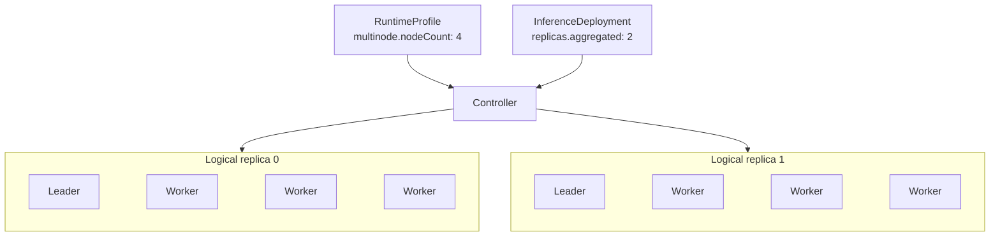

## Overview {#overview}

`RuntimeProfile` and `ClusterRuntimeProfile` declare reusable inference runtime templates, including the inference engine (`backend`), the inference image and startup arguments, how LoRA adapters are loaded, single-node or multinode deployment, and the Aggregated or Prefill/Decode roles. They differ only in scope:

- `RuntimeProfile` is a namespaced resource that can be reused within a Namespace.
- `ClusterRuntimeProfile` is a cluster-scoped resource that can be shared across Namespaces.

`RuntimeProfile` and `ClusterRuntimeProfile` use the same `RuntimeProfileSpec`. A Profile describes one logical replica per role; it neither specifies deployment replica counts nor binds to a specific Model.

The following is an example of an Aggregated RuntimeProfile. It uses the vLLM inference engine. The `engine` container in the Pod template runs the vLLM image, reads the model from `$(FUSION_MODEL_PATH)`, which the Operator injects, and serves inference on port 8000, named `http`:

```yaml
apiVersion: fusioninfer.io/v1alpha1
kind: RuntimeProfile
metadata:
  name: vllm-aggregated
  namespace: team-a
spec:
  backend: vllm
  aggregated:
    podTemplate:
      spec:
        containers:
          - name: engine
            image: vllm/vllm-openai:v0.27.1
            args:
              - $(FUSION_MODEL_PATH)
            ports:
              - name: http
                containerPort: 8000
```

## Spec {#spec}

### API Structure {#api-structure}

`RuntimeProfile` and `ClusterRuntimeProfile` share the following Go API:

```go
// RuntimeBackend is the inference engine of the runtime.
// +kubebuilder:validation:Enum=vllm;sglang
type RuntimeBackend string

const (
    RuntimeBackendVLLM   RuntimeBackend = "vllm"
    RuntimeBackendSGLang RuntimeBackend = "sglang"
)

// RuntimeProfileSpec declares a reusable inference runtime, and is shared by RuntimeProfile and ClusterRuntimeProfile.
type RuntimeProfileSpec struct {
    Backend    RuntimeBackend        `json:"backend"`
    LoRA       *RuntimeLoRASpec       `json:"lora,omitempty"`
    Aggregated *RuntimeComponentSpec `json:"aggregated,omitempty"`
    Prefiller  *RuntimeComponentSpec `json:"prefiller,omitempty"`
    Decoder    *RuntimeComponentSpec `json:"decoder,omitempty"`
}

// LoRALoadingMode is when the runtime loads the LoRA adapters bound to it.
// +kubebuilder:validation:Enum=preload;dynamic
type LoRALoadingMode string

const (
    LoRALoadingModePreload LoRALoadingMode = "preload"
    LoRALoadingModeDynamic LoRALoadingMode = "dynamic"
)

// RuntimeLoRASpec declares how the runtime loads the LoRA adapters that an InferenceDeployment binds.
type RuntimeLoRASpec struct {
    LoadingMode LoRALoadingMode `json:"loadingMode"`

    // Control-plane limit for one InferenceDeployment.
    // +kubebuilder:validation:Minimum=1
    MaxLoadedAdapters int32 `json:"maxLoadedAdapters"`
}

// RuntimeComponentSpec declares one role: the Pod template of a logical replica and whether the replica spans several nodes.
type RuntimeComponentSpec struct {
    PodTemplate corev1.PodTemplateSpec `json:"podTemplate"`
    Multinode   *MultinodeSpec         `json:"multinode,omitempty"`
}

// MultinodeSpec declares a logical replica that spans several nodes: one Leader and nodeCount - 1 Workers.
type MultinodeSpec struct {
    // +kubebuilder:validation:Minimum=2
    NodeCount int32 `json:"nodeCount"`
}
```

### Inference Modes and Roles {#role-fields}

The combination of role fields selects the inference mode:

| Role fields | Result |
| --- | --- |
| Only `aggregated` | Aggregated inference |
| Both `prefiller` and `decoder` | Prefill/Decode disaggregation |
| `aggregated` with `prefiller` or `decoder` | Invalid |
| Only one of `prefiller` and `decoder` | Invalid |
| None of the three | Invalid |

Each role uses the same `RuntimeComponentSpec`, and `multinode` decides how many Pods make up a logical replica:

|  | Without `multinode` | With `multinode.nodeCount: N` |
| --- | --- | --- |
| Logical replica | One Pod on one node | N Pods on N different Kubernetes Nodes: one Leader and N - 1 Workers |
| Pod template | `podTemplate` is the Pod | The Leader and the Workers are all derived from the same `podTemplate` |
| Use | Single-node inference, including a multi-GPU engine that requests several GPUs in one Pod | Models that must run across several nodes |

For example, `multinode.nodeCount: 4` means that one logical replica consists of one Leader Pod and three Worker Pods. If the corresponding `InferenceDeployment` sets `replicas.aggregated: 2`, the Controller creates two such logical replicas: two Leader Pods and six Worker Pods, for a total of eight Pods.



### Distributed Backend Execution {#distributed-backend-execution}

`backend` is required, is either `vllm` or `sglang`, and applies to all roles of a RuntimeProfile. When `multinode` is set, the Controller derives the Leader and the Workers from the same `podTemplate`: the Leader sets up the distributed runtime and serves inference, and the Workers join it. The backend adapter injects only the startup parameters that differ between the Leader and the Workers, such as the address, rank and node count; a Profile cannot declare these parameters, and everything else, including TP/PP/DP, stays as the Profile declares it.

#### vLLM {#backend-vllm}

The entrypoint is `vllm serve`, and the Profile declares the model path and engine parameters such as TP/PP/DP. When `multinode` is set, the adapter always uses vLLM's native multiprocessing executor and injects `--distributed-executor-backend mp`, `--nnodes`, `--master-addr`, `--master-port` and `--node-rank` into every Pod, plus `--headless` for the Workers. Only the Leader serves HTTP; the Workers only take part in distributed execution. For the full Leader and Worker arguments, see [Workload Orchestration: vLLM](./workload-orchestration.md#vllm).

#### SGLang {#backend-sglang}

The entrypoint is `python3 -m sglang.launch_server`, and the Profile declares the model parameters, `--tp-size`, `--dp-size` and the GPU resources of each Pod. When `multinode` is set, the adapter uses SGLang's native distributed launch and injects `--dist-init-addr`, `--nnodes` and `--node-rank` into every Pod. Only rank 0 serves HTTP; the other ranks run the scheduler and the distributed compute processes. For the full Leader and Worker arguments, see [Workload Orchestration: SGLang](./workload-orchestration.md#sglang).

### LoRA Loading Capabilities {#lora-loading-capabilities}

`spec.lora` declares whether the Profile can consume `InferenceDeployment.spec.lora` and fixes the LoRA loading lifecycle:

- When `lora` is omitted, the Profile does not accept LoRA bindings.
- `loadingMode: preload` materializes and mounts all LoRAs before the engine starts. A change to the binding set produces a new workload revision.
- `loadingMode: dynamic` loads or unloads LoRAs after the Base Model workload is running and does not restart the Base Model when the binding set changes.
- `maxLoadedAdapters` limits the number of LoRAs that one InferenceDeployment can bind at the same time.

`maxLoadedAdapters` is a control-plane limit across backends. It does not replace the engine's own GPU memory, CPU cache, maximum LoRA rank, or batch concurrency settings. The Profile author continues to fix these backend-specific parameters in `podTemplate`; the LoRA integration for the corresponding backend validates that known parameters are compatible with the control-plane limit without modifying TP/PP/DP.

The LoRA loading configuration is defined at the top level of the Profile, so Aggregated, Prefiller, and Decoder use the same mode. A P/D deployment must load every LoRA into all routable logical replicas of both the Prefiller and Decoder; it cannot select different loading modes for the two roles.

In dynamic mode, the `InferenceDeployment` Controller calls a Pod-local LoRA management endpoint through the backend integration built into the Operator. The Controller is the only Reconciler and owns the desired bindings, retries, and status; the management endpoint performs only idempotent load, unload, and list operations. If the backend already provides a management interface that satisfies the contract, the Operator uses it directly. Otherwise, the Operator may inject a thin stateless proxy as a backend-specific implementation detail instead of running a second control loop. The management port is not added to the inference Service, InferencePool, or HTTPRoute.

Multinode dynamic loading operates at the logical replica level. Depending on the engine's capabilities, the backend integration calls the Leader coordination interface or performs a controlled fan-out to all members of the logical replica. The logical replica is considered Ready only after the Leader and every Worker confirm that the target digest is loaded. Member selection, request formats, and error normalization remain internal to the backend integration and are not exposed through the RuntimeProfile interface.

### PodTemplate {#podtemplate}

The PodTemplate is a complete `corev1.PodTemplateSpec`, but only one template layer is allowed:

- Each role's `podTemplate` must contain a container named `engine`.
- `engine` must declare exactly one named port called `http`; in multinode mode, only the Leader is registered as a service Endpoint.
- All Pods use the Volcano scheduler configured by the Operator. The template's `schedulerName` must be empty or match that configuration.
- The metadata, containers, resources, and scheduling constraints from the same template apply to the Leader and Workers; the backend adapter generates only role-specific startup configuration and reserved environment variables.
- `InferenceDeployment` does not provide a second layer of Pod overrides.
- Template `metadata` may contain only labels and annotations. Resource names, Namespace, OwnerReference, finalizers, and other server-side metadata are managed by the Controller.
- When `lora` is configured, the template entrypoint must conform to the LoRA contract for the corresponding backend. The Profile declares the engine's LoRA enablement, rank, and backend-specific capacity parameters; the Deployment cannot override them.
- The Operator injects the management port, volume, mount, and environment variables required by dynamic mode, and the template cannot use these reserved names. A thin stateless proxy is injected only when the backend's native interface cannot satisfy the internal lifecycle contract; the proxy does not own desired state or perform independent reconciliation.

The Operator provides a uniform Model mount contract in every `engine` container:

```text
volume: fusioninfer-model
volume: fusioninfer-model-metadata
initContainer: fusioninfer-model-init
env: FUSION_MODEL_PATH
env: FUSION_MODEL_METADATA_PATH
volume: fusioninfer-lora
env: FUSION_LORA_ROOT
env: FUSION_LORA_MANIFEST
```

Model content is mounted read-only at the fixed path `/models`, and the following values are injected:

```text
FUSION_MODEL_PATH=/models
FUSION_MODEL_METADATA_PATH=/var/run/fusioninfer/model/model.json
```

Runtime commands should read the Model through `$(FUSION_MODEL_PATH)` rather than hard-coding the cache root. A Profile cannot declare the reserved fields above or override the materializer or Endpoint Picker images managed by the Operator.

When LoRA bindings are declared, the Operator also mounts the current Deployment's adapter projection read-only at `/adapters` and generates `/var/run/fusioninfer/lora/adapters.json`. The Manifest uses an internal binding key to map `servedName`, the resolved Model UID, the digest, and the in-container path; paths do not directly use the user-provided served name. The engine container can see only the LoRAs bound to the current Deployment and cannot browse the node cache root.

Inference images in production must be pinned by OCI digest. For readability, the following examples use the official versioned image `vllm/vllm-openai:v0.27.1`; replace it with the corresponding digest-pinned image when deploying.

### Scope and References {#scope-and-references}

`RuntimeProfile` does not contain a `modelRef`. The specific Model, runtime template, and replica counts are bound by `InferenceDeployment`.

A PodTemplate can reference a ServiceAccount, Secret, ConfigMap, and PVC:

- Namespaced dependencies in a `RuntimeProfile` are resolved in the Profile's Namespace.
- Namespaced dependency names in a `ClusterRuntimeProfile` are resolved in the Namespace of the `InferenceDeployment` that consumes it.
- A `ClusterRuntimeProfile` cannot pin dependencies in another Namespace.
- When a `ClusterRuntimeProfile` is created, only the reference structure is validated. The consumer reconciles whether each dependency exists and reports the result through `InferenceDeployment.status`.

The Profile neither owns nor modifies these dependencies. ConfigMaps and Secrets that affect startup behavior should use immutable objects or versioned names.

### Defaults and Validation {#defaults-and-validation}

- `backend` is required and must be `vllm` or `sglang`.
- `lora.loadingMode` must be `preload` or `dynamic`; `maxLoadedAdapters` must be at least 1.
- A Profile can be consumed only when the current Operator version implements the selected LoRA mode for the specified backend and template entrypoint.
- `aggregated` must be set, or both `prefiller` and `decoder` must be set.
- Every declared role must provide a `podTemplate`.
- When `multinode` is set, `nodeCount` must be at least 2; when it is omitted, the role is treated as single-node.
- `podTemplate` must be a valid `corev1.PodTemplateSpec`; the API server validates it against the Pod schema.
- The template must contain an `engine` container and exactly one named `http` port.
- The template cannot use Operator-reserved volumes, init containers, environment variables, mount paths, labels, or annotations.
- The backend adapter must support the image and entrypoint arguments declared in the template.
- The template cannot declare executor, address, rank, `nnodes`, or headless parameters reserved by the backend adapter.
- The template image must be pinned by OCI digest.
- `RuntimeProfile.spec` and `ClusterRuntimeProfile.spec` are immutable. Changing the backend, image, command, resources, `multinode`, or PodTemplate requires a new object.

## Status {#status}

`RuntimeProfile` and `ClusterRuntimeProfile` do not provide a status subresource and do not require a dedicated Controller. Admission validates constraints within the object, while the consuming `InferenceDeployment.status` holds the state of Namespaced dependencies and the actual runtime.

## Examples {#examples}

### RuntimeProfile: Single-Node Aggregated {#runtimeprofile-single-node-aggregated}

This Profile describes an Aggregated logical replica that uses one GPU.

```yaml
apiVersion: fusioninfer.io/v1alpha1
kind: RuntimeProfile
metadata:
  name: vllm-aggregated-a10-r1
  namespace: team-a
spec:
  backend: vllm
  aggregated:
    podTemplate:
      metadata:
        labels:
          example.fusioninfer.io/runtime: vllm
      spec:
        containers:
          - name: engine
            image: vllm/vllm-openai:v0.27.1
            args:
              - $(FUSION_MODEL_PATH)
            ports:
              - name: http
                containerPort: 8000
            readinessProbe:
              httpGet:
                path: /health
                port: http
            resources:
              requests:
                cpu: "4"
                memory: 16Gi
              limits:
                nvidia.com/gpu: "1"
        nodeSelector:
          accelerator: a10
```

### ClusterRuntimeProfile: Prefill/Decode Disaggregation {#clusterruntimeprofile-prefilldecode-disaggregation}

The Prefiller and Decoder declare their KV transfer roles separately. The Profile does not contain replica counts or an Endpoint Picker policy.

```yaml
apiVersion: fusioninfer.io/v1alpha1
kind: ClusterRuntimeProfile
metadata:
  name: vllm-pd-h100-r1
spec:
  backend: vllm
  prefiller:
    podTemplate:
      spec:
        containers:
          - name: engine
            image: vllm/vllm-openai:v0.27.1
            args:
              - $(FUSION_MODEL_PATH)
              - --kv-transfer-config
              - '{"kv_connector":"NixlConnector","kv_role":"kv_producer"}'
            ports:
              - name: http
                containerPort: 8000
            resources:
              limits:
                nvidia.com/gpu: "2"
        nodeSelector:
          accelerator: h100
  decoder:
    podTemplate:
      spec:
        containers:
          - name: engine
            image: vllm/vllm-openai:v0.27.1
            args:
              - $(FUSION_MODEL_PATH)
              - --kv-transfer-config
              - '{"kv_connector":"NixlConnector","kv_role":"kv_consumer"}'
            ports:
              - name: http
                containerPort: 8000
            resources:
              limits:
                nvidia.com/gpu: "1"
        nodeSelector:
          accelerator: h100
```

### RuntimeProfile: Multinode Aggregated {#runtimeprofile-multinode-aggregated}

Each logical replica consists of one Leader Pod and three Worker Pods, using four nodes in total.

```yaml
apiVersion: fusioninfer.io/v1alpha1
kind: RuntimeProfile
metadata:
  name: vllm-aggregated-4node-r1
  namespace: team-a
spec:
  backend: vllm
  aggregated:
    multinode:
      nodeCount: 4
    podTemplate:
      spec:
        containers:
          - name: engine
            image: vllm/vllm-openai:v0.27.1
            args:
              - $(FUSION_MODEL_PATH)
              - --port
              - "8000"
              - --tensor-parallel-size
              - "8"
              - --pipeline-parallel-size
              - "4"
              - --data-parallel-size
              - "1"
            ports:
              - name: http
                containerPort: 8000
            resources:
              limits:
                nvidia.com/gpu: "8"
        nodeSelector:
          accelerator: h100
```

The `backend: vllm` adapter injects the multiprocessing executor, node count, address, and rank for the Leader and Workers based on `nodeCount: 4`. It preserves the `TP=8`, `PP=4`, and `DP=1` values fixed in the Profile, so the user maintains only one set of vLLM arguments and one PodTemplate.

### RuntimeProfile: Dynamic LoRA {#runtimeprofile-dynamic-lora}

This Profile allows a Deployment to bind up to eight LoRAs dynamically. vLLM's LoRA enablement and backend-specific capacity remain fixed in the PodTemplate. The Operator configures the protected Pod-local management endpoint and the environment variables required for runtime updates, while the `InferenceDeployment` Controller reconciles loading state through the backend integration.

```yaml
apiVersion: fusioninfer.io/v1alpha1
kind: RuntimeProfile
metadata:
  name: vllm-aggregated-lora-dynamic-r1
  namespace: team-a
spec:
  backend: vllm
  lora:
    loadingMode: dynamic
    maxLoadedAdapters: 8
  aggregated:
    podTemplate:
      spec:
        containers:
          - name: engine
            image: vllm/vllm-openai:v0.27.1
            args:
              - $(FUSION_MODEL_PATH)
              - --enable-lora
              - --max-loras
              - "8"
              - --max-cpu-loras
              - "8"
            ports:
              - name: http
                containerPort: 8000
            resources:
              limits:
                nvidia.com/gpu: "1"
        nodeSelector:
          accelerator: h100
```
