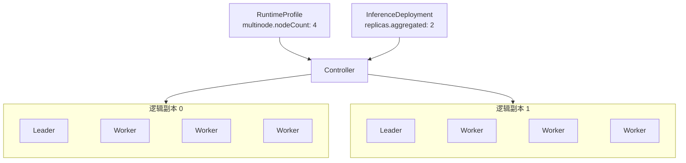

## 概述 {#overview}

`RuntimeProfile` 和 `ClusterRuntimeProfile` 声明可复用的推理运行模板，包括推理引擎（`backend`）、推理镜像和启动参数、LoRA 适配器的加载方式、单节点或多节点部署，以及 Aggregated 或 Prefill/Decode 角色。两者只有作用范围不同：

- `RuntimeProfile` 是 Namespaced 资源，用于 Namespace 内复用。
- `ClusterRuntimeProfile` 是 Cluster-scoped 资源，用于跨 Namespace 共享。

`RuntimeProfile` 和 `ClusterRuntimeProfile` 使用相同的 `RuntimeProfileSpec`。Profile 描述每个角色的单个逻辑副本，不包含部署副本数，也不绑定具体 Model。

下面是一个 Aggregated RuntimeProfile 的示例。它使用 vLLM 推理引擎，Pod 模板中的 `engine` 容器运行 vLLM 镜像，从 Controller 注入的 `$(FUSIONINFER_MODEL_PATH)` 读取模型，并通过名为 `http` 的 8000 端口提供推理服务：

```yaml
apiVersion: fusioninfer.io/v1alpha1
kind: RuntimeProfile
metadata:
  name: vllm-aggregated
  namespace: team-a
spec:
  backend: vllm
  aggregated:
    podTemplate:
      spec:
        containers:
          - name: engine
            image: vllm/vllm-openai:v0.27.1
            args:
              - $(FUSIONINFER_MODEL_PATH)
            ports:
              - name: http
                containerPort: 8000
```

## Spec {#spec}

### API 结构 {#api-structure}

`RuntimeProfile` 与 `ClusterRuntimeProfile` 共享以下 Go 接口：

```go
// RuntimeBackend 是运行时使用的推理引擎。
// +kubebuilder:validation:Enum=vllm;sglang
type RuntimeBackend string

const (
    RuntimeBackendVLLM   RuntimeBackend = "vllm"
    RuntimeBackendSGLang RuntimeBackend = "sglang"
)

// RuntimeProfileSpec 声明可复用的推理运行时，由 RuntimeProfile 与 ClusterRuntimeProfile 共用。
type RuntimeProfileSpec struct {
    Backend    RuntimeBackend        `json:"backend"`
    LoRA       *RuntimeLoRASpec       `json:"lora,omitempty"`
    Aggregated *RuntimeComponentSpec `json:"aggregated,omitempty"`
    Prefiller  *RuntimeComponentSpec `json:"prefiller,omitempty"`
    Decoder    *RuntimeComponentSpec `json:"decoder,omitempty"`
}

// LoRALoadingMode 表示运行时在什么时候加载绑定的 LoRA 适配器。
// +kubebuilder:validation:Enum=preload;dynamic
type LoRALoadingMode string

const (
    LoRALoadingModePreload LoRALoadingMode = "preload"
    LoRALoadingModeDynamic LoRALoadingMode = "dynamic"
)

// RuntimeLoRASpec 声明运行时如何加载 InferenceDeployment 绑定的 LoRA 适配器。
type RuntimeLoRASpec struct {
    LoadingMode LoRALoadingMode `json:"loadingMode"`
}

// RuntimeComponentSpec 声明一个角色：单个逻辑副本的 Pod 模板，以及副本是否跨多个节点。
type RuntimeComponentSpec struct {
    PodTemplate corev1.PodTemplateSpec `json:"podTemplate"`
    Multinode   *MultinodeSpec         `json:"multinode,omitempty"`
}

// MultinodeSpec 声明跨多个节点的逻辑副本，包含一个 Leader 和 nodeCount - 1 个 Worker。
type MultinodeSpec struct {
    // +kubebuilder:validation:Minimum=2
    NodeCount int32 `json:"nodeCount"`
}
```

### 推理模式与角色 {#role-fields}

角色字段的组合决定推理模式：

| 角色字段 | 结果 |
| --- | --- |
| 只设置 `aggregated` | 聚合推理 |
| 同时设置 `prefiller` 和 `decoder` | Prefill/Decode 分离 |
| `aggregated` 与 `prefiller` 或 `decoder` 同时设置 | 不合法 |
| 只设置 `prefiller` 和 `decoder` 中的一个 | 不合法 |
| 三个都不设置 | 不合法 |

每个角色使用相同的 `RuntimeComponentSpec`，由 `multinode` 决定一个逻辑副本由几个 Pod 组成：

|  | 未设置 `multinode` | 设置 `multinode.nodeCount: N` |
| --- | --- | --- |
| 逻辑副本 | 一个 Pod，运行在一个节点上 | N 个 Pod，分布在 N 个不同的 Kubernetes Node 上：1 个 Leader 和 N - 1 个 Worker |
| Pod 模板 | `podTemplate` 就是这个 Pod | Leader 和 Worker 都由同一份 `podTemplate` 派生 |
| 适用场景 | 单节点推理。单节点多 GPU 的推理引擎也属于这种情况，在一个 Pod 中申请多张 GPU | 需要跨多个节点运行的模型 |

例如，`multinode.nodeCount: 4` 表示一个逻辑副本由 1 个 Leader Pod 和 3 个 Worker Pod 组成。如果对应的 `InferenceDeployment` 设置 `replicas.aggregated: 2`，Controller 会创建 2 个这样的逻辑副本，也就是 2 个 Leader Pod 和 6 个 Worker Pod，共 8 个 Pod。



### Backend 分布式运行 {#distributed-backend-execution}

当前支持 `vllm` 和 `sglang` 两种 backend，一个 RuntimeProfile 的所有角色都使用同一种 backend。设置 `multinode` 后，Controller 用同一份 `podTemplate` 生成 Leader 和 Worker，并按 backend 注入各自的分布式启动参数。

两种 backend 的多节点启动方式如下：

- vLLM 使用原生的 multiprocessing executor，Worker 以 headless 模式加入 Leader，具体参数见[工作负载编排：vLLM](./workload-orchestration.md#vllm)。
- SGLang 使用原生的分布式启动方式，只有 rank 0 对外提供 HTTP 服务，具体参数见[工作负载编排：SGLang](./workload-orchestration.md#sglang)。

### LoRA 加载方式 {#lora-loading-capabilities}

`spec.lora` 声明 RuntimeProfile 的 LoRA 配置：

- `loadingMode: preload`：推理引擎启动时加载全部 LoRA，绑定变化时会按新的 LoRA 列表重新部署工作负载。
- `loadingMode: dynamic`：在运行中的推理引擎上加载和卸载 LoRA，绑定变化不会重启 Base Model。

下面的示例以 `dynamic` 方式加载 LoRA，LoRA 容量由 `podTemplate` 中的推理引擎参数（例如 vLLM 的 `--max-loras`）决定：

```yaml
spec:
  backend: vllm
  lora:
    loadingMode: dynamic
  aggregated:
    podTemplate:
      spec:
        containers:
          - name: engine
            args:
              - $(FUSIONINFER_MODEL_PATH)
              - --enable-lora
              - --max-loras
              - "8"
```

`lora` 位于 Profile 顶层，所有角色使用同一种加载方式。LoRA 的加载和卸载流程见 [InferenceDeployment：LoRA 绑定](./inference-deployment.md#lora-bindings)。

### Pod 模板 {#podtemplate}

`podTemplate` 是完整的 [`corev1.PodTemplateSpec`](https://github.com/kubernetes/api/blob/v0.35.3/core/v1/types.go#L5483-L5494)。推理引擎运行在名为 `engine` 的容器中，通过命名端口 `http` 提供服务；多节点时只有 Leader 接收推理请求。

Controller 会在生成的 Pod 中自动注入以下内容，模板中不能再声明这些名称和路径，否则创建或更新 Profile 时会被拒绝：

| 类型 | 名称 | 说明 |
| --- | --- | --- |
| 环境变量 | `FUSIONINFER_MODEL_PATH` | 值为模型目录 `/models`。启动命令应通过 `$(FUSIONINFER_MODEL_PATH)` 读取模型 |
| Volume | `fusioninfer-model` | 只读挂载模型目录 `/models` |
| Volume | `fusioninfer-lora` | 只读挂载 LoRA 目录 `/adapters`，只包含当前 Deployment 绑定的 LoRA |
| Init container | `fusioninfer-model-init` | 检查节点上的模型缓存，缺失时下载模型 |

InferenceDeployment 绑定了 LoRA 时，Controller 才会注入 `fusioninfer-lora`，并按加载方式把 LoRA 交给推理引擎：

- `preload`：把绑定的 LoRA 写进启动参数，推理引擎启动时加载。例如 InferenceDeployment 绑定了 `finance` 和 `customer-support` 两个 LoRA 时，Controller 会在 vLLM 的启动参数后面追加：

  ```bash
  --lora-modules \
    finance=/adapters/qwen3-8b-finance-lora-r1 \
    customer-support=/adapters/qwen3-8b-support-lora-r1
  ```

  每个 LoRA 一项，等号左边是请求中选择该 LoRA 用的模型名，右边是它在 `/adapters` 下的路径。

- `dynamic`：开启推理引擎的运行时 LoRA 接口，例如为 vLLM 设置 `VLLM_ALLOW_RUNTIME_LORA_UPDATING=true`；Pod 运行后，Controller 调用这个接口加载和卸载 LoRA。

### 作用域与引用 {#scope-and-references}

`RuntimeProfile` 自身不包含 `modelRef`。具体 Model、运行模板和副本数由 `InferenceDeployment` 绑定。

Pod 模板可以引用 ServiceAccount、Secret、ConfigMap 和 PVC：

- `RuntimeProfile` 中的 Namespaced 依赖在 Profile 所在 Namespace 中解析。
- `ClusterRuntimeProfile` 中的 Namespaced 依赖名称在消费它的 `InferenceDeployment` Namespace 中解析。
- `ClusterRuntimeProfile` 不能固定其他 Namespace 中的依赖。
- 创建 `ClusterRuntimeProfile` 时只校验引用结构；依赖是否存在由消费方调和并通过 `InferenceDeployment.status` 报告。

Profile 不拥有或修改这些依赖。对启动行为有影响的 ConfigMap 和 Secret 应使用 immutable 对象或版本化名称。

### 默认值与校验 {#defaults-and-validation}

- `backend` 必填，只允许 `vllm` 或 `sglang`。
- `lora.loadingMode` 只允许 `preload` 或 `dynamic`。
- 只有当前 FusionInfer 版本为指定 backend 和模板入口实现了对应 LoRA 模式时，Profile 才能被消费。
- 必须设置 `aggregated`，或者同时设置 `prefiller` 和 `decoder`。
- 每个已声明角色都必须提供 `podTemplate`。
- 设置 `multinode` 时，`nodeCount` 必须大于等于 2；省略时按单节点处理。
- `podTemplate` 必须是合法的 `corev1.PodTemplateSpec`，由 API server 按 Pod schema 校验。
- 模板必须包含 `engine` 容器及唯一的 `http` 命名端口。
- 模板 `metadata` 只能设置 labels 和 annotations。
- 模板中的 `schedulerName` 必须为空或等于 FusionInfer 配置的 Volcano scheduler。
- 模板不能占用 Controller 注入的 volume、init container、环境变量、挂载路径、label 或 annotation。
- 当前 FusionInfer 版本必须支持模板中声明的镜像和入口参数。
- 模板不能声明 Controller 按 backend 注入的 executor、地址、rank、`nnodes`、headless 参数或 LoRA 列表。
- 模板镜像必须使用 OCI digest 固定。本文示例为了便于阅读使用版本 tag。
- `RuntimeProfile.spec` 和 `ClusterRuntimeProfile.spec` 不可变。修改 backend、镜像、命令、资源、`multinode` 或 Pod 模板时需要创建新对象。

## Status {#status}

`RuntimeProfile` 和 `ClusterRuntimeProfile` 不提供 status subresource，也不需要独立 Controller。对象内约束由 Admission 校验，Namespace 依赖和实际运行状态由消费它的 `InferenceDeployment.status` 持有。

## 示例 {#examples}

### RuntimeProfile：单节点 Aggregated {#runtimeprofile-single-node-aggregated}

该 Profile 描述一个使用单张 GPU 的 Aggregated 逻辑副本。

```yaml
apiVersion: fusioninfer.io/v1alpha1
kind: RuntimeProfile
metadata:
  name: vllm-aggregated-a10-r1
  namespace: team-a
spec:
  backend: vllm
  aggregated:
    podTemplate:
      metadata:
        labels:
          example.fusioninfer.io/runtime: vllm
      spec:
        containers:
          - name: engine
            image: vllm/vllm-openai:v0.27.1
            args:
              - $(FUSIONINFER_MODEL_PATH)
            ports:
              - name: http
                containerPort: 8000
            readinessProbe:
              httpGet:
                path: /health
                port: http
            resources:
              requests:
                cpu: "4"
                memory: 16Gi
              limits:
                nvidia.com/gpu: "1"
        nodeSelector:
          accelerator: a10
```

### ClusterRuntimeProfile：Prefill/Decode 分离 {#clusterruntimeprofile-prefilldecode-disaggregation}

Prefiller 和 Decoder 分别声明 KV 传输角色。Profile 不包含副本数或 Endpoint Picker 策略。

```yaml
apiVersion: fusioninfer.io/v1alpha1
kind: ClusterRuntimeProfile
metadata:
  name: vllm-pd-h100-r1
spec:
  backend: vllm
  prefiller:
    podTemplate:
      spec:
        containers:
          - name: engine
            image: vllm/vllm-openai:v0.27.1
            args:
              - $(FUSIONINFER_MODEL_PATH)
              - --kv-transfer-config
              - '{"kv_connector":"NixlConnector","kv_role":"kv_producer"}'
            ports:
              - name: http
                containerPort: 8000
            resources:
              limits:
                nvidia.com/gpu: "2"
        nodeSelector:
          accelerator: h100
  decoder:
    podTemplate:
      spec:
        containers:
          - name: engine
            image: vllm/vllm-openai:v0.27.1
            args:
              - $(FUSIONINFER_MODEL_PATH)
              - --kv-transfer-config
              - '{"kv_connector":"NixlConnector","kv_role":"kv_consumer"}'
            ports:
              - name: http
                containerPort: 8000
            resources:
              limits:
                nvidia.com/gpu: "1"
        nodeSelector:
          accelerator: h100
```

### RuntimeProfile：多节点 Aggregated {#runtimeprofile-multinode-aggregated}

每个逻辑副本由一个 Leader Pod 和三个 Worker Pod 组成，共使用四个节点。

```yaml
apiVersion: fusioninfer.io/v1alpha1
kind: RuntimeProfile
metadata:
  name: vllm-aggregated-4node-r1
  namespace: team-a
spec:
  backend: vllm
  aggregated:
    multinode:
      nodeCount: 4
    podTemplate:
      spec:
        containers:
          - name: engine
            image: vllm/vllm-openai:v0.27.1
            args:
              - $(FUSIONINFER_MODEL_PATH)
              - --port
              - "8000"
              - --tensor-parallel-size
              - "8"
              - --pipeline-parallel-size
              - "4"
              - --data-parallel-size
              - "1"
            ports:
              - name: http
                containerPort: 8000
            resources:
              limits:
                nvidia.com/gpu: "8"
        nodeSelector:
          accelerator: h100
```

Controller 根据 `backend: vllm` 和 `nodeCount: 4` 为 Leader 和 Worker 注入 multiprocessing executor、节点数、地址和 rank。它保留 Profile 中固定的 `TP=8`、`PP=4` 和 `DP=1`，用户只维护一份 vLLM 参数和 Pod 模板。

### RuntimeProfile：动态 LoRA {#runtimeprofile-dynamic-lora}

该 Profile 以 `dynamic` 方式加载 LoRA。vLLM 的 LoRA enablement 和 backend-specific 容量固定在 Pod 模板中；`InferenceDeployment` Controller 负责配置受保护的 Pod-local management endpoint 和 runtime updating 环境变量，并通过 backend integration 调和加载状态。

```yaml
apiVersion: fusioninfer.io/v1alpha1
kind: RuntimeProfile
metadata:
  name: vllm-aggregated-lora-dynamic-r1
  namespace: team-a
spec:
  backend: vllm
  lora:
    loadingMode: dynamic
  aggregated:
    podTemplate:
      spec:
        containers:
          - name: engine
            image: vllm/vllm-openai:v0.27.1
            args:
              - $(FUSIONINFER_MODEL_PATH)
              - --enable-lora
              - --max-loras
              - "8"
              - --max-cpu-loras
              - "8"
            ports:
              - name: http
                containerPort: 8000
            resources:
              limits:
                nvidia.com/gpu: "1"
        nodeSelector:
          accelerator: h100
```
