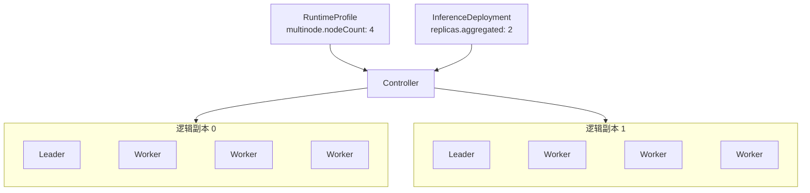

## 概述 {#overview}

`RuntimeProfile` 和 `ClusterRuntimeProfile` 声明可复用的推理运行模板，包括推理引擎（`backend`）、推理镜像和启动参数、LoRA 适配器的加载方式、单节点或多节点部署，以及 Aggregated 或 Prefill/Decode 角色。两者只有作用范围不同：

- `RuntimeProfile` 是 Namespaced 资源，用于 Namespace 内复用。
- `ClusterRuntimeProfile` 是 Cluster-scoped 资源，用于跨 Namespace 共享。

`RuntimeProfile` 和 `ClusterRuntimeProfile` 使用相同的 `RuntimeProfileSpec`。Profile 描述每个角色的单个逻辑副本，不包含部署副本数，也不绑定具体 Model。

下面是一个 Aggregated RuntimeProfile 的示例。它使用 vLLM 推理引擎，Pod 模板中的 `engine` 容器运行 vLLM 镜像，从 Operator 注入的 `$(FUSION_MODEL_PATH)` 读取模型，并通过名为 `http` 的 8000 端口提供推理服务：

```yaml
apiVersion: fusioninfer.io/v1alpha1
kind: RuntimeProfile
metadata:
  name: vllm-aggregated
  namespace: team-a
spec:
  backend: vllm
  aggregated:
    podTemplate:
      spec:
        containers:
          - name: engine
            image: vllm/vllm-openai:v0.27.1
            args:
              - $(FUSION_MODEL_PATH)
            ports:
              - name: http
                containerPort: 8000
```

## Spec {#spec}

### API 结构 {#api-structure}

`RuntimeProfile` 与 `ClusterRuntimeProfile` 共享以下 Go 接口：

```go
// RuntimeBackend 是运行时使用的推理引擎。
// +kubebuilder:validation:Enum=vllm;sglang
type RuntimeBackend string

const (
    RuntimeBackendVLLM   RuntimeBackend = "vllm"
    RuntimeBackendSGLang RuntimeBackend = "sglang"
)

// RuntimeProfileSpec 声明可复用的推理运行时，由 RuntimeProfile 与 ClusterRuntimeProfile 共用。
type RuntimeProfileSpec struct {
    Backend    RuntimeBackend        `json:"backend"`
    LoRA       *RuntimeLoRASpec       `json:"lora,omitempty"`
    Aggregated *RuntimeComponentSpec `json:"aggregated,omitempty"`
    Prefiller  *RuntimeComponentSpec `json:"prefiller,omitempty"`
    Decoder    *RuntimeComponentSpec `json:"decoder,omitempty"`
}

// LoRALoadingMode 表示运行时在什么时候加载绑定的 LoRA 适配器。
// +kubebuilder:validation:Enum=preload;dynamic
type LoRALoadingMode string

const (
    LoRALoadingModePreload LoRALoadingMode = "preload"
    LoRALoadingModeDynamic LoRALoadingMode = "dynamic"
)

// RuntimeLoRASpec 声明运行时如何加载 InferenceDeployment 绑定的 LoRA 适配器。
type RuntimeLoRASpec struct {
    LoadingMode LoRALoadingMode `json:"loadingMode"`

    // 单个 InferenceDeployment 的控制面上限。
    // +kubebuilder:validation:Minimum=1
    MaxLoadedAdapters int32 `json:"maxLoadedAdapters"`
}

// RuntimeComponentSpec 声明一个角色：单个逻辑副本的 Pod 模板，以及副本是否跨多个节点。
type RuntimeComponentSpec struct {
    PodTemplate corev1.PodTemplateSpec `json:"podTemplate"`
    Multinode   *MultinodeSpec         `json:"multinode,omitempty"`
}

// MultinodeSpec 声明跨多个节点的逻辑副本，包含一个 Leader 和 nodeCount - 1 个 Worker。
type MultinodeSpec struct {
    // +kubebuilder:validation:Minimum=2
    NodeCount int32 `json:"nodeCount"`
}
```

### 推理模式与角色 {#role-fields}

角色字段的组合决定推理模式：

| 角色字段 | 结果 |
| --- | --- |
| 只设置 `aggregated` | 聚合推理 |
| 同时设置 `prefiller` 和 `decoder` | Prefill/Decode 分离 |
| `aggregated` 与 `prefiller` 或 `decoder` 同时设置 | 不合法 |
| 只设置 `prefiller` 和 `decoder` 中的一个 | 不合法 |
| 三个都不设置 | 不合法 |

每个角色使用相同的 `RuntimeComponentSpec`，由 `multinode` 决定一个逻辑副本由几个 Pod 组成：

|  | 未设置 `multinode` | 设置 `multinode.nodeCount: N` |
| --- | --- | --- |
| 逻辑副本 | 一个 Pod，运行在一个节点上 | N 个 Pod，分布在 N 个不同的 Kubernetes Node 上：1 个 Leader 和 N - 1 个 Worker |
| Pod 模板 | `podTemplate` 就是这个 Pod | Leader 和 Worker 都由同一份 `podTemplate` 派生 |
| 适用场景 | 单节点推理。单节点多 GPU 的引擎也属于这种情况，在一个 Pod 中申请多张 GPU | 需要跨多个节点运行的模型 |

例如，`multinode.nodeCount: 4` 表示一个逻辑副本由 1 个 Leader Pod 和 3 个 Worker Pod 组成。如果对应的 `InferenceDeployment` 设置 `replicas.aggregated: 2`，Controller 会创建 2 个这样的逻辑副本，也就是 2 个 Leader Pod 和 6 个 Worker Pod，共 8 个 Pod。



### Backend 分布式运行 {#distributed-backend-execution}

`backend` 必填，可选 `vllm` 和 `sglang`，同一个 RuntimeProfile 的所有角色使用相同的 backend。设置 `multinode` 后，Controller 用同一份 `podTemplate` 生成 Leader 和 Worker：Leader 建立分布式运行环境并对外提供推理服务，Worker 加入这个环境。backend adapter 只注入地址、rank、节点数等随 Leader 和 Worker 变化的启动参数，这些参数不能在 Profile 中预先声明，其余配置（包括 TP/PP/DP）都沿用 Profile 中的写法。

两种 backend 的多节点启动方式如下：

- vLLM 使用原生的 multiprocessing executor，Worker 以 headless 模式加入 Leader，具体参数见[工作负载编排：vLLM](./workload-orchestration.md#vllm)。
- SGLang 使用原生的分布式启动方式，只有 rank 0 对外提供 HTTP 服务，具体参数见[工作负载编排：SGLang](./workload-orchestration.md#sglang)。

### LoRA 加载方式 {#lora-loading-capabilities}

`spec.lora` 声明该 Profile 能否消费 `InferenceDeployment.spec.lora`，并固定 LoRA 的加载生命周期：

- 省略 `lora` 时，该 Profile 不接受 LoRA 绑定。
- `loadingMode: preload` 在引擎启动前下载、缓存并挂载全部 LoRA。绑定集合变化会生成新的 workload revision。
- `loadingMode: dynamic` 在 Base Model 工作负载运行后加载或卸载 LoRA，不因绑定集合变化重启 Base Model。
- `maxLoadedAdapters` 限制单个 InferenceDeployment 可以同时绑定的 LoRA 数量。

`maxLoadedAdapters` 是跨 backend 的控制面上限，不替代引擎自己的显存、CPU 缓存、最大 LoRA rank 或 batch 并发参数。这些 backend-specific 参数继续由 Profile 作者固定在 `podTemplate` 中；对应 backend 的 LoRA 集成会校验已知参数与控制面上限是否兼容，而不会修改 TP/PP/DP。

LoRA 加载配置位于 Profile 顶层，因此 Aggregated、Prefiller 和 Decoder 使用相同模式。P/D 部署必须把每个 LoRA 加载到 Prefiller 与 Decoder 的全部可路由逻辑副本，不能为两个角色选择不同的加载模式。

动态模式由 `InferenceDeployment` Controller 通过 Operator 内置的 backend integration 调用 Pod-local LoRA management endpoint。Controller 是唯一的 Reconciler，持有期望绑定、重试和状态；management endpoint 只执行幂等的 load、unload 和 list 操作。backend 已提供满足契约的管理接口时直接使用；否则 Operator 可以注入薄的无状态代理作为 backend-specific 实现细节，而不是再运行第二个控制循环。管理端口不会加入推理 Service、InferencePool 或 HTTPRoute。

多节点的动态加载以逻辑副本为单位。backend integration 根据引擎能力调用 Leader 协调接口，或向该逻辑副本的全部成员执行受控 fan-out；只有 Leader 和全部 Worker 都确认目标 digest 已加载，该逻辑副本才计为 Ready。成员选择、请求格式和错误归一化隐藏在 backend integration 内，不进入 RuntimeProfile 接口。

### Pod 模板 {#podtemplate}

Pod 模板是完整的 `corev1.PodTemplateSpec`，但只允许一层模板：

- 每个角色的 `podTemplate` 必须包含名为 `engine` 的容器。
- `engine` 必须声明唯一的命名端口 `http`；多节点模式只把 Leader 注册为服务 Endpoint。
- 所有 Pod 使用 Operator 配置的 Volcano scheduler；模板中的 `schedulerName` 必须为空或与该配置一致。
- 同一份模板的 metadata、容器、资源和调度约束应用于 Leader 与 Worker，backend adapter 只生成角色相关的启动配置和保留环境变量。
- `InferenceDeployment` 不提供第二层 Pod override。
- 模板 `metadata` 只允许设置 labels 和 annotations；资源名称、Namespace、OwnerReference、finalizer 和其他服务端元数据由 Controller 管理。
- 配置 `lora` 时，模板入口必须符合对应 backend 的 LoRA 契约。Profile 负责声明引擎的 LoRA enablement、rank 和 backend-specific 容量参数；Deployment 不能覆盖这些参数。
- 动态模式所需的管理端口、volume、mount 和环境变量由 Operator 注入，模板不能占用这些保留名称。只有 backend 原生接口不能满足内部 lifecycle 契约时才注入薄的无状态代理；该代理不持有期望状态，也不执行独立调和。

Operator 在所有 `engine` 容器中提供统一的模型挂载契约：

```text
volume: fusioninfer-model
volume: fusioninfer-model-metadata
initContainer: fusioninfer-model-init
env: FUSION_MODEL_PATH
env: FUSION_MODEL_METADATA_PATH
volume: fusioninfer-lora
env: FUSION_LORA_ROOT
env: FUSION_LORA_MANIFEST
```

模型内容以只读方式挂载到固定路径 `/models`，并注入：

```text
FUSION_MODEL_PATH=/models
FUSION_MODEL_METADATA_PATH=/var/run/fusioninfer/model/model.json
```

Runtime 命令应通过 `$(FUSION_MODEL_PATH)` 读取模型，不应写死缓存根目录。Profile 不能声明上述保留字段，也不能覆盖 Operator 管理的模型下载组件或 Endpoint Picker 镜像。

声明 LoRA 绑定时，Operator 还把当前 Deployment 的 adapter projection 只读挂载到 `/adapters`，并生成 `/var/run/fusioninfer/lora/adapters.json`。Manifest 使用内部 binding key 映射 `servedName`、resolved Model UID、digest 和容器内路径；路径不直接使用用户提供的 served name。引擎容器只能看到当前 Deployment 已绑定的 LoRA，不能浏览节点缓存根目录。

生产环境中的推理镜像必须使用 OCI digest 固定。以下示例使用官方版本化镜像 `vllm/vllm-openai:v0.27.1` 以保持可读性，部署时需要替换为对应版本的 digest-pinned 镜像。

### 作用域与引用 {#scope-and-references}

`RuntimeProfile` 自身不包含 `modelRef`。具体 Model、运行模板和副本数由 `InferenceDeployment` 绑定。

Pod 模板可以引用 ServiceAccount、Secret、ConfigMap 和 PVC：

- `RuntimeProfile` 中的 Namespaced 依赖在 Profile 所在 Namespace 中解析。
- `ClusterRuntimeProfile` 中的 Namespaced 依赖名称在消费它的 `InferenceDeployment` Namespace 中解析。
- `ClusterRuntimeProfile` 不能固定其他 Namespace 中的依赖。
- 创建 `ClusterRuntimeProfile` 时只校验引用结构；依赖是否存在由消费方调和并通过 `InferenceDeployment.status` 报告。

Profile 不拥有或修改这些依赖。对启动行为有影响的 ConfigMap 和 Secret 应使用 immutable 对象或版本化名称。

### 默认值与校验 {#defaults-and-validation}

- `backend` 必填，只允许 `vllm` 或 `sglang`。
- `lora.loadingMode` 只允许 `preload` 或 `dynamic`；`maxLoadedAdapters` 必须大于等于 1。
- 只有当前 Operator 版本为指定 backend 和模板入口实现了对应 LoRA 模式时，Profile 才能被消费。
- 必须设置 `aggregated`，或者同时设置 `prefiller` 和 `decoder`。
- 每个已声明角色都必须提供 `podTemplate`。
- 设置 `multinode` 时，`nodeCount` 必须大于等于 2；省略时按单节点处理。
- `podTemplate` 必须是合法的 `corev1.PodTemplateSpec`，由 API server 按 Pod schema 校验。
- 模板必须包含 `engine` 容器及唯一的 `http` 命名端口。
- 模板不能占用 Operator 保留的 volume、init container、环境变量、挂载路径、label 或 annotation。
- backend adapter 必须支持模板中声明的镜像和入口参数。
- 模板不能声明 backend adapter 保留的 executor、地址、rank、`nnodes` 或 headless 参数。
- 模板镜像必须使用 OCI digest 固定。
- `RuntimeProfile.spec` 和 `ClusterRuntimeProfile.spec` 不可变。修改 backend、镜像、命令、资源、`multinode` 或 Pod 模板时需要创建新对象。

## Status {#status}

`RuntimeProfile` 和 `ClusterRuntimeProfile` 不提供 status subresource，也不需要独立 Controller。对象内约束由 Admission 校验，Namespace 依赖和实际运行状态由消费它的 `InferenceDeployment.status` 持有。

## 示例 {#examples}

### RuntimeProfile：单节点 Aggregated {#runtimeprofile-single-node-aggregated}

该 Profile 描述一个使用单张 GPU 的 Aggregated 逻辑副本。

```yaml
apiVersion: fusioninfer.io/v1alpha1
kind: RuntimeProfile
metadata:
  name: vllm-aggregated-a10-r1
  namespace: team-a
spec:
  backend: vllm
  aggregated:
    podTemplate:
      metadata:
        labels:
          example.fusioninfer.io/runtime: vllm
      spec:
        containers:
          - name: engine
            image: vllm/vllm-openai:v0.27.1
            args:
              - $(FUSION_MODEL_PATH)
            ports:
              - name: http
                containerPort: 8000
            readinessProbe:
              httpGet:
                path: /health
                port: http
            resources:
              requests:
                cpu: "4"
                memory: 16Gi
              limits:
                nvidia.com/gpu: "1"
        nodeSelector:
          accelerator: a10
```

### ClusterRuntimeProfile：Prefill/Decode 分离 {#clusterruntimeprofile-prefilldecode-disaggregation}

Prefiller 和 Decoder 分别声明 KV 传输角色。Profile 不包含副本数或 Endpoint Picker 策略。

```yaml
apiVersion: fusioninfer.io/v1alpha1
kind: ClusterRuntimeProfile
metadata:
  name: vllm-pd-h100-r1
spec:
  backend: vllm
  prefiller:
    podTemplate:
      spec:
        containers:
          - name: engine
            image: vllm/vllm-openai:v0.27.1
            args:
              - $(FUSION_MODEL_PATH)
              - --kv-transfer-config
              - '{"kv_connector":"NixlConnector","kv_role":"kv_producer"}'
            ports:
              - name: http
                containerPort: 8000
            resources:
              limits:
                nvidia.com/gpu: "2"
        nodeSelector:
          accelerator: h100
  decoder:
    podTemplate:
      spec:
        containers:
          - name: engine
            image: vllm/vllm-openai:v0.27.1
            args:
              - $(FUSION_MODEL_PATH)
              - --kv-transfer-config
              - '{"kv_connector":"NixlConnector","kv_role":"kv_consumer"}'
            ports:
              - name: http
                containerPort: 8000
            resources:
              limits:
                nvidia.com/gpu: "1"
        nodeSelector:
          accelerator: h100
```

### RuntimeProfile：多节点 Aggregated {#runtimeprofile-multinode-aggregated}

每个逻辑副本由一个 Leader Pod 和三个 Worker Pod 组成，共使用四个节点。

```yaml
apiVersion: fusioninfer.io/v1alpha1
kind: RuntimeProfile
metadata:
  name: vllm-aggregated-4node-r1
  namespace: team-a
spec:
  backend: vllm
  aggregated:
    multinode:
      nodeCount: 4
    podTemplate:
      spec:
        containers:
          - name: engine
            image: vllm/vllm-openai:v0.27.1
            args:
              - $(FUSION_MODEL_PATH)
              - --port
              - "8000"
              - --tensor-parallel-size
              - "8"
              - --pipeline-parallel-size
              - "4"
              - --data-parallel-size
              - "1"
            ports:
              - name: http
                containerPort: 8000
            resources:
              limits:
                nvidia.com/gpu: "8"
        nodeSelector:
          accelerator: h100
```

`backend: vllm` adapter 根据 `nodeCount: 4` 为 Leader 和 Worker 注入 multiprocessing executor、节点数、地址和 rank。它保留 Profile 中固定的 `TP=8`、`PP=4` 和 `DP=1`，用户只维护一份 vLLM 参数和 Pod 模板。

### RuntimeProfile：动态 LoRA {#runtimeprofile-dynamic-lora}

该 Profile 允许一个 Deployment 动态绑定最多八个 LoRA。vLLM 的 LoRA enablement 和 backend-specific 容量仍固定在 Pod 模板中；Operator 负责配置受保护的 Pod-local management endpoint 和 runtime updating 环境变量，`InferenceDeployment` Controller 通过 backend integration 调和加载状态。

```yaml
apiVersion: fusioninfer.io/v1alpha1
kind: RuntimeProfile
metadata:
  name: vllm-aggregated-lora-dynamic-r1
  namespace: team-a
spec:
  backend: vllm
  lora:
    loadingMode: dynamic
    maxLoadedAdapters: 8
  aggregated:
    podTemplate:
      spec:
        containers:
          - name: engine
            image: vllm/vllm-openai:v0.27.1
            args:
              - $(FUSION_MODEL_PATH)
              - --enable-lora
              - --max-loras
              - "8"
              - --max-cpu-loras
              - "8"
            ports:
              - name: http
                containerPort: 8000
            resources:
              limits:
                nvidia.com/gpu: "1"
        nodeSelector:
          accelerator: h100
```
